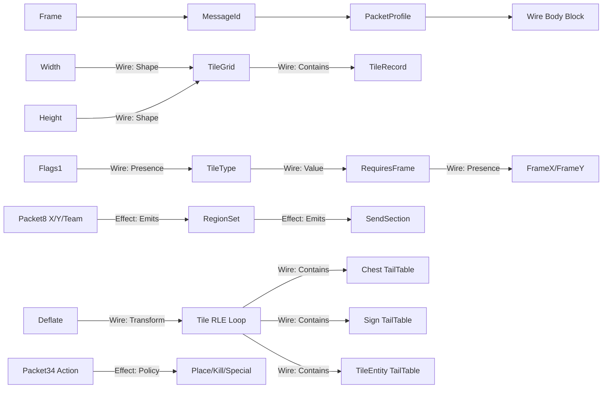

# NetMessage / MessageBuffer 依赖图设计提案

状态：设计提案；本文件不授权生成器、codec、运行时或项目配置实现。

日期：2026-08-06

## 1. 目标

用一张可查询、可验证、可视化的关系图描述 Terraria 网络消息的真实关系，同时不把发送路由、服务器业务副作用和一次解析过程中的临时状态误当成静态 wire schema。

本提案基于以下两个原始文件的发送端和接收端双向读取：

- `D:\ProjectItem\SourceCode\chain14\Terraria\NetMessage.cs`
- `D:\ProjectItem\SourceCode\chain14\Terraria\MessageBuffer.cs`

目标不是从旧代码直接生成新代码，而是先冻结关系语义和验证边界。

## 2. 源码事实与纠正

### 2.1 Packet 13 是真正的条件 wire layout

发送端 case 13 依次写入 player id、四个 `BitsByte`、selected item、position，再按 flag 写入 velocity、mount type、药水位置块和 camera target。接收端 case 13 以相同顺序读取。

因此：

```text
ControlFlags2.bit2 -> Velocity
ControlFlags2.bit7 -> MountType
ControlFlags3.bit6 -> PotionBlock(Original, Home)
ControlFlags4.bit5 -> CameraTarget
```

这些是 `wire` 域的 `Presence` 关系。

源码：

- [`NetMessage.cs`](../../../../../../chain14/Terraria/NetMessage.cs:444)
- [`MessageBuffer.cs`](../../../../../../chain14/Terraria/MessageBuffer.cs:941)

### 2.2 Packet 20 是二维重复 wire layout

case 20 的头部顺序为：

```text
StartX, StartY, Width, Height, ChangeType
```

发送端以 `x` 外层、`y` 内层遍历 tile；每个 tile 先写三个 flag byte，再写条件字段。接收端以同样顺序读取。

源码：

- [`NetMessage.cs`](../../../../../../chain14/Terraria/NetMessage.cs:539)
- [`MessageBuffer.cs`](../../../../../../chain14/Terraria/MessageBuffer.cs:1315)

它需要：

```text
Width  --Shape--> TileGrid
Height --Shape--> TileGrid
TileGrid --Contains--> TileRecordTemplate
TileRecordTemplate --Sequence--> Flags1, Flags2, Flags3, ...
Flags2.bit2 --Presence--> TileColor
Flags2.bit3 --Presence--> WallColor
Flags1.bit0 --Presence--> TileType
TileType --Value--> RequiresFrame --Presence--> FrameX, FrameY
Flags1.bit2 --Presence--> WallType
Flags1.bit3 + ServerContext --Presence--> LiquidPayload
```

### 2.3 Packet 7 是固定长度 block，不是动态条件树

case 7 写入大量固定字段、四组固定数组和大量 `BitsByte` 状态块。`SocialAPI.Network == null` 只改变 lobby id 的值，不改变线上字段是否存在。`TreeTops.SyncSend` 和 `ExtraSpawnPointManager.Write` 是有界的 delegated block，不能在没有读取其实现时假定内部字段。

源码：

- [`NetMessage.cs`](../../../../../../chain14/Terraria/NetMessage.cs:225)
- [`MessageBuffer.cs`](../../../../../../chain14/Terraria/MessageBuffer.cs:467)

图中应使用 `Block + Loop(Exactly(n)) + PackedBits`，而不是给每个状态位建一个可选字段。

### 2.4 Packet 8 的区域循环属于 effect/routing 域

Packet 8 的线上 body 只有：

```text
int x
int y
byte team
```

接收端读取完后，服务器才计算 spawn section、请求 section、team spawn section、portal sections，去重为 `List<Point>`，再调用多个 `SendSection`。

源码：

- [`NetMessage.cs`](../../../../../../chain14/Terraria/NetMessage.cs:409)
- [`MessageBuffer.cs`](../../../../../../chain14/Terraria/MessageBuffer.cs:651)

因此之前“Packet 8 是多个重叠 section 的 wire Loop”的说法不准确。正确模型是：

```text
Wire domain:
X -> Y -> Team

Effect domain:
X/Y -> SectionProjector
TeamContext -> OptionalTeamRegion
PortalSections -> RegionSet
RegionSet -> Deduplicate
Deduplicate -> Emits(SendSection)
```

`Emits`、`Deduplicate`、`Policy` 不能参与 wire field 的拓扑排序和 codec 依赖校验。

### 2.5 Packet 21/90/145/148 是 profile 选择，不是普通 flag optional

`NetMessage.SendData` 在进入 payload switch 前就可能把 message type `21` 改成 `145` 或 `151`。case 21、90、145、148 共享基础 item body，145 和 148 在消息 profile 层追加不同尾部字段。

源码：

- [`NetMessage.cs`](../../../../../../chain14/Terraria/NetMessage.cs:103)
- [`NetMessage.cs`](../../../../../../chain14/Terraria/NetMessage.cs:642)
- [`MessageBuffer.cs`](../../../../../../chain14/Terraria/MessageBuffer.cs:1425)

正确关系是：

```text
Envelope.MessageId -> Select(ItemProfile)
ItemProfile -> BaseItemBlock
Profile145 -> ShimmerBlock
Profile148 -> PickupCooldown
```

这不是 `FlagsByte.bitX -> field` 的同一种关系。

### 2.6 Packet 23 和 27 需要 Select，但业务门禁不能混入 wire graph

Packet 23 的生命值使用宽度 tag 选择 `sbyte`、`short` 或 `int`；稀疏 AI 使用 flags 决定哪些数组元素出现；catchable NPC 再追加 release owner。Packet 27 的第二个 flags byte 只有在第一个 flags byte 的 bit2 为真时才出现，UUID 是否出现还依赖 projectile type 的静态集合。

源码：

- [`NetMessage.cs`](../../../../../../chain14/Terraria/NetMessage.cs:684)
- [`MessageBuffer.cs`](../../../../../../chain14/Terraria/MessageBuffer.cs:1569)
- [`NetMessage.cs`](../../../../../../chain14/Terraria/NetMessage.cs:773)
- [`MessageBuffer.cs`](../../../../../../chain14/Terraria/MessageBuffer.cs:1716)

`Main.projHostile`、server owner 覆盖、NPC slot 查找和重新初始化是 `Policy/Effect` 关系，不是字段存在性关系。

### 2.7 Packet 50/54 是 sentinel Loop

buff 列表没有 count，发送端写有效项后写 `ushort 0`；接收端用 `while (ReadUInt16() > 0)` 读取并清理剩余槽位。

源码：

- [`NetMessage.cs`](../../../../../../chain14/Terraria/NetMessage.cs:999)
- [`MessageBuffer.cs`](../../../../../../chain14/Terraria/MessageBuffer.cs:2473)
- [`MessageBuffer.cs`](../../../../../../chain14/Terraria/MessageBuffer.cs:2596)

这必须建模为：

```text
Loop(boundary = Until(terminator = 0), maxItems = declared capacity)
```

不能伪装为 `Count(source)`。

### 2.8 Packet 10 是 Transform + stateful Loop + TailLoop

`CompressTileBlock` 在 message 10 中建立 Deflate 子流，写入 `(xStart, yStart, width, height)`，再由 `CompressTileBlock_Inner` 扫描 tile。其扫描顺序是 `y` 外层、`x` 内层，与 case 20 相反。

压缩正文还包含：

- 多级 flag cascade：后续 flag byte 是否出现由前一层 bit 控制；
- type 低/高字节选择；
- frame-important、color、wall、liquid、wire、slope、visibility 条件；
- 相邻 tile 相等时的 RLE run length；
- run length 的短/长编码选择；
- chest、sign、tile entity 三个尾随表。

源码：

- [`NetMessage.cs`](../../../../../../chain14/Terraria/NetMessage.cs:1906)
- [`NetMessage.cs`](../../../../../../chain14/Terraria/NetMessage.cs:2249)

图模型应表达：

```text
Transform(Deflate)
  -> Loop(
       boundary = Area(width, height),
       iteration = y-outer/x-inner,
       state = previousTile + pendingRun)
  -> Block(role = TailTable)
       -> Loop(ChestRecords)
       -> Loop(SignRecords)
       -> Loop(TileEntityRecords)
```

`previousTile` 和 `pendingRun` 是解析实例状态，不得放进不可变静态定义图。

### 2.9 Packet 34 的 Select 属于 effect dispatch

Packet 34 固定写入 action、坐标、tile type、style 和 chest id。接收端按 action 分派 chest、dresser 和特殊 chest 的业务操作，但分支没有不同的 wire 字段布局。

源码：

- [`NetMessage.cs`](../../../../../../chain14/Terraria/NetMessage.cs:917)
- [`MessageBuffer.cs`](../../../../../../chain14/Terraria/MessageBuffer.cs:2005)

因此应记录：

```text
Wire: Action, X, Y, Style, ChestId
Effect: Action -> Select(Place/Kill/Special)
```

不能把 effect-level `Select` 误报为 wire-level union。

## 3. 一张图的分层设计

采用一个不可变 `ProtocolRelationshipGraph`，但每条边必须声明 `domain`：

```text
Wire:
  Contains, Sequence, Presence, Shape, Value, Context, Transform

Effect:
  Emits, Applies, Rebroadcasts, Policy, Normalizes
```

只有 `Wire` 域参与静态协议校验和未来的 codec 投影；`Effect` 域只作为可查询的行为关系，不改变 wire order，也不产生字段。

这样仍然是一张图，但不会把 Packet 8 的 section 发送循环错误地当成 Packet 8 payload。

### 3.1 节点类型

节点集合保持小而深：

| 节点 | 责任 |
| --- | --- |
| `Atom` | 一个线上字段、packed bit projection、selector 或固定领域值 |
| `Block` | 一个有声明顺序和作用域的子结构；`role=TailTable` 表示尾表 |
| `Gate` | 条件成立时激活一个字段或 block；条件必须是可显示表达式 |
| `Select` | 根据已读取 selector 或 profile 选择一个结构分支 |
| `Loop` | `Exactly`、`Count`、`Area`、`Until` 或 `RunLength` 重复边界 |
| `Transform` | 一个有界输入/输出子流，如 Deflate |
| `ContextRef` | 只读协议上下文，如 net mode、message profile、sender identity |
| `Effect` | 业务应用、广播、发送下一类消息等非 wire 行为 |

`Predicate`、`SideTable` 和 `PackedFlag` 不单独扩张节点种类：

- `Predicate` 是 `Gate` 或 `Select` 的显式表达式节点；
- `SideTable` 是 `Block(role=TailTable)` + `Loop`；
- `PackedFlag` 是带 bit metadata 的 `Atom`。

### 3.2 节点接口（概念级）

```text
Node
- id: StableId
- kind: Atom | Block | Gate | Select | Loop | Transform | ContextRef | Effect
- scope: ScopeId
- localOrder: int?
- wireType: WireType?
- valueType: LogicalType?
- metadata: immutable key/value data

Edge
- source: NodeId
- target: NodeId
- domain: Wire | Effect
- kind: Contains | Sequence | Presence | Shape | Value | Context |
         Transform | Emits | Applies | Rebroadcasts | Policy | Normalizes
- expression: explicit Predicate/Selector expression?
```

`localOrder` 只表示同一 `Block` 中的线序。不能通过全图拓扑排序重排字段。

### 3.3 Loop 边界

Loop 必须显式声明 boundary 和 iteration order：

```text
Exactly(n)
Count(source)
Area(widthSource, heightSource, iteration = x-outer/y-inner)
Until(predicate, terminator, maxItems)
RunLength(countEncoding, stateSlots, maxExpandedItems)
EffectSet(sourceCollection, deduplicate = true)
```

其中 `EffectSet` 只能出现在 Effect 域；Packet 8 的 section 集合不能伪装成 wire `Area` Loop。

## 4. 统一关系图示例



图中虚线或不同颜色只用于展示域；静态校验必须按 `domain` 分开执行。

## 5. 作用域、上下文和实例状态

### 静态定义图允许保存

- 字段名、逻辑类型和 wire type；
- 同一 Block 内 local wire order；
- flag bit、selector、profile 名称；
- Loop boundary、最大项数和 iteration order；
- Transform 类型和子流预算；
- ContextRef 的名称、版本和只读声明。

### 静态定义图禁止保存

- 当前 tile、NPC、Player 或 Item 的运行时值；
- `Main`、`MessageBuffer` 或世界对象引用；
- `previousTile`、`pendingRun`、临时 AI 数组等解析实例状态；
- `BinaryReader` / `BinaryWriter` 实例；
- 直接执行 `NetMessage.TrySendData`、`WorldGen` 或 `Main.*` 业务副作用的 delegate。

一次读写应另有 `ProtocolInstance` 保存：

```text
Blueprint graph
  -> ProtocolInstance
       values
       presence decisions
       selected profile/variant
       loop counters and state
       wire spans
       diagnostics
```

这保持模块的 seam：静态图负责关系和验证，未来的 codec adapter 负责字节读写，effect adapter 负责业务应用和广播。

## 6. 静态图校验不变量

1. 节点 ID 唯一，所有边端点属于同一 graph。
2. `Contains` 必须形成 scope tree；节点不能隐式跨 scope 引用。
3. `Sequence` 只允许在同一 Block 内，且由 local order 决定。
4. Wire 依赖边不能引用尚未声明的前置字段，除非来源是已声明的 `ContextRef` 或静态 metadata。
5. `Area` Loop 必须明确两个维度源，并明确 x/y iteration order。
6. `Until` Loop 必须有 terminator 和最大项数。
7. `RunLength` Loop 必须声明展开上限和实例状态槽，不得产生无限展开。
8. `Select` 必须声明 selector，并保证分支互斥或具有明确的 last-resort 规则。
9. `Gate` 的条件必须是可审计表达式，不能是不可见 lambda。
10. Transform 子流必须有输入边界、完整消费要求和预算。
11. Effect 域的 `Emits`、`Applies` 和 `Policy` 不得改变 wire 字段顺序或参与 wire dependency cycle 检查。
12. `MessageId` profile 选择必须在 payload block 解析前确定；Packet 21 -> 145/151 的发送端重写必须作为 envelope policy 记录。
13. 业务副作用节点只能被查询或生成诊断，不能从静态 graph 直接执行。

## 7. 首批冻结的静态关系

第一批只冻结以下关系，不进入生成器：

| 消息 | Wire 域 | Effect 域 |
| --- | --- | --- |
| 13 | 四组 Flags、可选字段 block | server identity override、rebroadcast |
| 20 | `Area(width,height)`、tile flag、frame value dependency | tile change callback、server rebroadcast |
| 7 | 固定数组、packed state、delegated tail block | join sequencing |
| 8 | `X,Y,Team` 三字段 | region projection、dedup、`SendSection` emission |
| 21/90/145/148 | base item block + profile tail | materialize、reservation、rebroadcast |
| 23 | sparse AI、life-width select、conditional owner | NPC slot reuse、server gating |
| 27 | nested flags、optional payload、UUID rule | hostile/owner security policy |
| 50/54 | sentinel loops | server rebroadcast |
| 65 | target-kind select、optional extra int | teleport application、ack handling |
| 10 | Deflate、RLE、tail tables | world/tile application |
| 34 | fixed action body | chest/dresser action dispatch |

## 8. 非目标和验收

本提案明确不做：

- 不从旧源码自动生成 C#；
- 不实现 packet codec；
- 不把 `MessageBuffer` 业务副作用迁移到 graph；
- 不修复现有 `Concept/test1`、`test2`、`test3` 的执行缺口；
- 不修改 `NetWork.csproj` 或项目 active/archive 边界。

设计阶段的验收证据应是：

1. Packet 8 被证明为三字段 wire graph + 独立 effect graph，而不是区域 payload graph。
2. Packet 34 被证明为固定 wire body + effect-level action select。
3. Packet 20 和 Packet 10 的相反二维扫描顺序都在 Loop metadata 中可见。
4. Packet 50/54 的 sentinel boundary 与 Packet 23 的 width selector 不再被归并成普通 variable field。
5. Packet 10 的 Transform、RLE state 和三个 tail tables 都能在图中查询。
6. 图能导出 wire order、dependency kind、scope 和 effect domain，但不执行任何业务操作。

只有这些关系冻结并通过静态图校验后，才讨论是否需要一个 codec adapter 或 Graphviz/JSON exporter。
